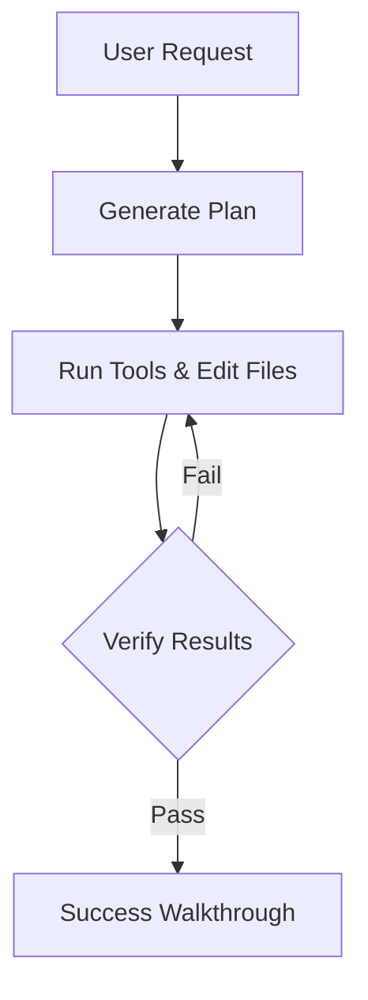

## Introduction

Agentic AI represents a shift from static prompt-response templates to autonomous, goal-driven agents. Rather than answering a query in a single turn, an agentic system breaks down a user's request, plans a sequence of actions, calls external APIs, and evaluates its own progress.

In this article, we'll look at how to build and orchestrate these agentic workflows inside a Next.js App Router project.

## The Planning-Execution Model

A typical coding agent uses a loop that runs in three distinct stages:

1. **Plan**: Analyze the goal, check constraints, and write a sequential plan.
2. **Execute**: Call tools (file read/write, terminal command execution, web search) step-by-step.
3. **Verify**: Test the changes, handle errors, and format the final answer.

Here is a simplified flowchart of how an agent interacts with a workspace:

## Why Next.js?

Next.js Server Actions and Route Handlers provide the perfect runtime for AI orchestration. Since these execute on the server, you can safely load API keys, perform direct filesystem manipulations (for local code agents), or make heavy database queries without exposing sensitive resources to the client.

Furthermore, with Next.js 15, we can stream structured UI elements directly from the server to the client using React Server Components (RSC) and Suspense.

### Key Performance Patterns

To ensure agent responses remain responsive and do not hit HTTP timeouts:
- Use **Server-Sent Events (SSE)** to stream tokens immediately.
- Run heavy background tasks asynchronously (e.g. using queue managers).
- Leverage React's optimistic UI updates to show the agent's "thinking" state.
