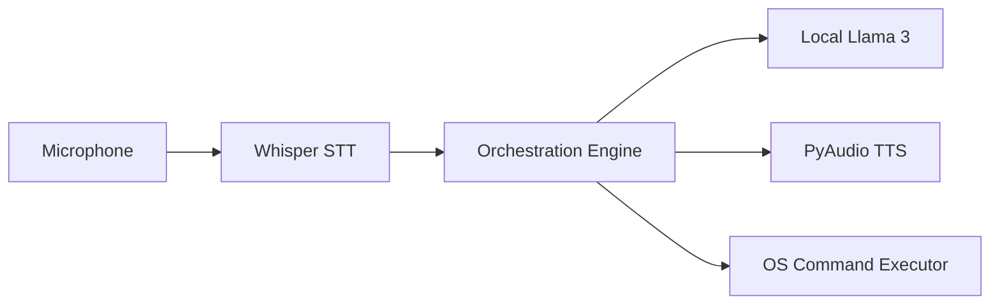

## Overview

MOHINI is a conversational desktop assistant designed to handle natural, emotionally aware dialogue and perform local PC tasks. Unlike cloud-locked assistants, MOHINI is built to execute locally, ensuring private and low-latency response cycles.

In this post, we'll cover the core software architecture of MOHINI, focusing on speech-to-text (STT), local large language models (LLMs), and system integrations.

## Core System Architecture

The assistant operates as a continuous loop listening for a wake-word, processing user voice inputs, generating a contextual response, and performing actions.

### 1. Voice Ingestion & STT
For voice ingestion, MOHINI uses a lightweight wake-word detector like **Porcupine** or custom audio thresholding in Python, combined with **OpenAI Whisper** running locally via `faster-whisper` for speech-to-text.

### 2. Local Inference & LLM Engine
Response generation is handled by a quantized model (e.g. Llama-3-8B-Instruct in 4-bit precision) hosted locally using **Llama.cpp** or **Ollama**. This setup enables sub-100ms time-to-first-token.

### 3. Action Mapping & Execution
To run tasks (like opening apps, control volume, or finding files), the assistant translates LLM function calls into secure local scripts.
