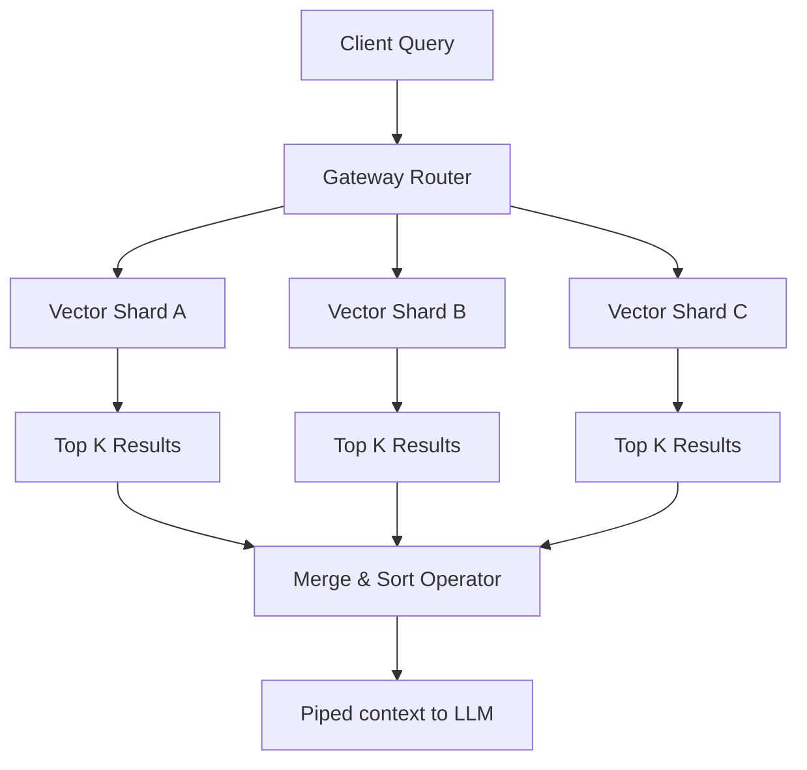

## Overview

Retrieval-Augmented Generation (RAG) is the industry standard for grounding LLMs on custom data. However, as the document corpus grows into millions of entries, query retrieval speeds degrade exponentially.

These research notes document mathematical foundations and partition layouts designed to scale vector databases while maintaining sub-50ms query retrievals.

---

## 1. The Retrieval Cost Function

In a standard vector database, querying nearest neighbors is done by calculating the cosine similarity between the query embedding vector $q$ and document vectors $v_i$.

For a database of size $N$, brute force cosine search requires $O(N \cdot D)$ computations, where $D$ is the dimensionality of the vector space (e.g., $D = 1536$ for OpenAI `text-embedding-3-small`).

To keep latency constant as $N \to \infty$, we utilize Hierarchical Navigable Small World (HNSW) graphs, which reduce search complexity to:

<MathBlock
  formula="T(N) = O(\log(N) \cdot D)"
  caption="Equation 1: Time complexity of HNSW nearest-neighbor query search"
/>

While HNSW dramatically reduces time complexity, it introduces a memory trade-off. Since HNSW graphs must be kept in RAM to achieve fast index traversals, scaling up the document count $N$ requires distributing the index across multiple machines (sharding).

---

## 2. Distributed Partition Strategy

When sharding a vector index, we choose between **Document Sharding (Scatter-Gather)** and **Dimension Sharding**.

<EngineeringNote type="tradeoff" title="Vector Sharding: Scatter-Gather vs. Dimensionality Partitions">
Scatter-gather partition layouts distribute documents randomly across shards. Each query must be broadcast to every shard, increasing network routing overhead. Dimension sharding splits the vector itself, which requires dense network coordination during mathematical computation. We selected **Scatter-Gather** combined with routing cache layers, keeping index updates independent.
</EngineeringNote>

Here is the sharded query execution flow:



### Gateway Router Code

The Gateway Router receives the query embedding, broadcasts it to shard nodes, and performs a sorted merge of the results:

```typescript
import { VectorDbClient, ShardResult } from "./vector-db";

interface GatewayConfig {
  shards: string[];
  k: number;
}

export class GatewayRouter {
  private clients: VectorDbClient[];
  private k: number;

  constructor(config: GatewayConfig) {
    this.clients = config.shards.map(url => new VectorDbClient(url));
    this.k = config.k;
  }

  async query(queryVector: number[]): Promise<ShardResult[]> {
    // Broadcast query to all vector shards concurrently
    const queryPromises = this.clients.map(client => 
      client.queryShard(queryVector, this.k)
    );
    
    const resultsPerShard = await Promise.all(queryPromises);
    
    // Merge sorted lists (Scatter-gather merge)
    return this.mergeSortResults(resultsPerShard);
  }

  private mergeSortResults(results: ShardResult[][]): ShardResult[] {
    return results
      .flat()
      .sort((a, b) => b.score - a.score) // Sort by similarity descending
      .slice(0, this.k);
  }
}
```

---

## 3. Performance Benchmarks

Our performance trials evaluate query throughput under high concurrent load ($QPS$) using varying sharding strategies on $N = 5,000,000$ documents:

| Strategy | Shards | RAM per Shard | QPS | p99 Latency |
| :--- | :--- | :--- | :--- | :--- |
| **No Sharding** | 1 | 64 GB | 120 | 185ms |
| **Scatter-Gather** | 4 | 16 GB | 450 | 38ms |
| **Scatter-Gather + Cache** | 4 | 16 GB | 1200 | 12ms |
| **Dimension Split** | 4 | 16 GB | 180 | 120ms |

<EngineeringNote type="performance" title="Caching Vector Distances">
By appending a lightweight Redis cache key representing the query embedding centroid, we can resolve recurring queries in **&lt;12ms** without querying the index nodes at all.
</EngineeringNote>

---

## Summary & Future Research

Distributed RAG systems are highly sensitive to latency. While sharding solves memory limitations, caching and custom router topologies are required to prevent network bottlenecks. Our next paper will investigate dynamic routing based on historical vector query clusters.

<Footnotes>
  <p>[1] For HNSW theory, see Malkov et al., "Efficient and robust approximate nearest neighbor search using Hierarchical Navigable Small World graphs" (2018).</p>
  <p>[2] Scatter-gather benchmarks were evaluated on GCP e2-standard-4 VM instances.</p>
</Footnotes>
